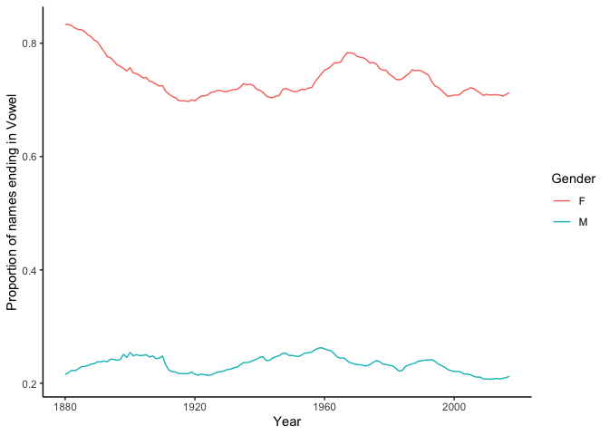
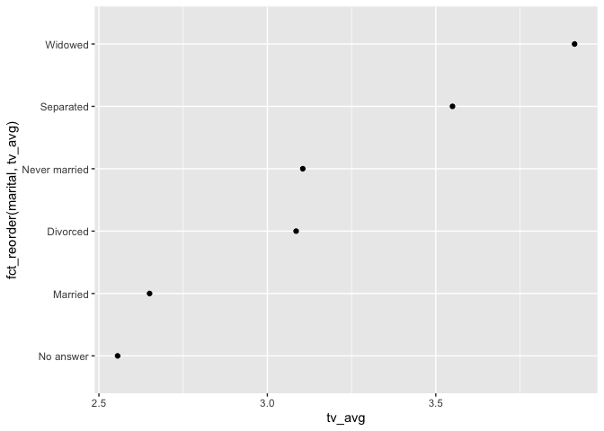
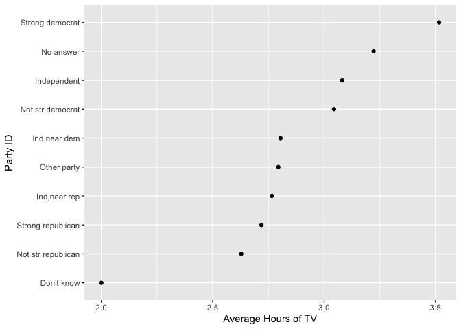
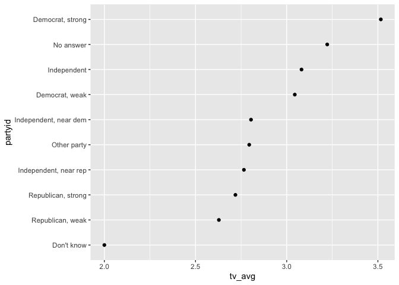
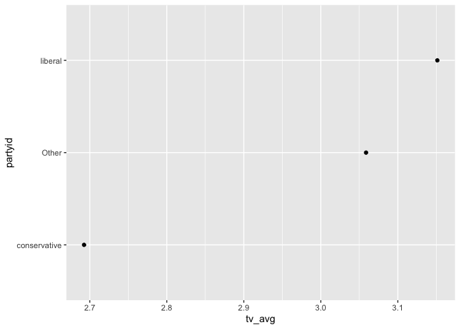
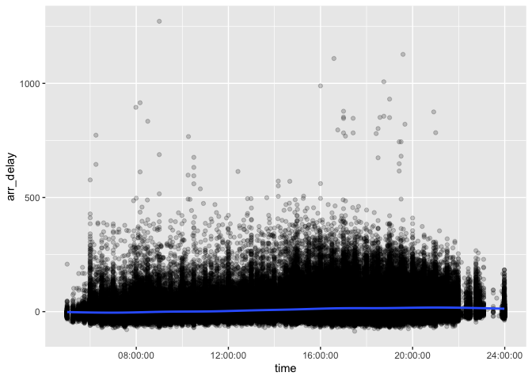
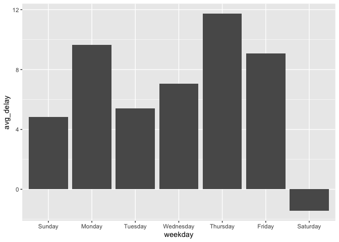

Data Types
================
Juan Ramirez Jr.

``` r
library(tidyverse)
```

    ## ── Attaching packages ─────────────────────────────────────── tidyverse 1.3.1 ──

    ## ✓ ggplot2 3.3.5     ✓ purrr   0.3.4
    ## ✓ tibble  3.1.6     ✓ dplyr   1.0.7
    ## ✓ tidyr   1.2.0     ✓ stringr 1.4.0
    ## ✓ readr   2.1.2     ✓ forcats 0.5.1

    ## ── Conflicts ────────────────────────────────────────── tidyverse_conflicts() ──
    ## x dplyr::filter() masks stats::filter()
    ## x dplyr::lag()    masks stats::lag()

``` r
library(babynames)
library(nycflights13)
library(lubridate)
```

    ## 
    ## Attaching package: 'lubridate'

    ## The following objects are masked from 'package:base':
    ## 
    ##     date, intersect, setdiff, union

``` r
library(hms)
```

    ## 
    ## Attaching package: 'hms'

    ## The following object is masked from 'package:lubridate':
    ## 
    ##     hms

# Logicals

``` r
flights %>% 
  mutate(delayed = arr_delay > 0) %>% 
  select(arr_delay, delayed)
```

    ## # A tibble: 336,776 × 2
    ##    arr_delay delayed
    ##        <dbl> <lgl>  
    ##  1        11 TRUE   
    ##  2        20 TRUE   
    ##  3        33 TRUE   
    ##  4       -18 FALSE  
    ##  5       -25 FALSE  
    ##  6        12 TRUE   
    ##  7        19 TRUE   
    ##  8       -14 FALSE  
    ##  9        -8 FALSE  
    ## 10         8 TRUE   
    ## # … with 336,766 more rows

## Your Turn 1

Use `flights` to create `delayed`, a variable that displays whether a
flight was delayed (`arr_delay > 0`).

Then, remove all rows that contain an NA in `delayed`.

Finally, create a summary table that shows:

1.  How many flights were delayed  
2.  What proportion of flights were delayed

``` r
flights %>%
  mutate(delayed = arr_delay > 0) %>%
  drop_na(delayed) %>%
  summarise(total = sum(delayed), prop = mean(delayed))
```

    ## # A tibble: 1 × 2
    ##    total  prop
    ##    <int> <dbl>
    ## 1 133004 0.406

# Strings

## Your Turn 2

In your group, fill in the blanks to:

1.  Isolate the last letter of every name

2.  Create a logical variable that displays whether the last letter is
    one of “a”, “e”, “i”, “o”, “u”, or “y”.

3.  Use a weighted mean to calculate the proportion of children whose
    name ends in a vowel (by `year` and `sex`)  

4.  and then display the results as a line plot.

*(Hint: Be sure to remove each `_` before running the code)*

``` r
babynames %>%
  mutate(last = str_sub(name, -1), 
          vowel = last %in% c("a","e","i","o","u","y")) %>%
  group_by(year, sex) %>%
  summarise(p_vowel = weighted.mean(vowel, n)) %>%
  ggplot(aes(x = year, y = p_vowel)) +
  geom_line(aes(color = sex)) +
  labs(x = "Year", y = "Proportion of names ending in Vowel",
       color = "Gender") +
  theme_classic()
```

    ## `summarise()` has grouped output by 'year'. You can override using the `.groups`
    ## argument.

<!-- -->

# Factors

## Your Turn 3

Repeat the demonstration, some of whose code is below, to make a
sensible graph of average TV consumption by marital status.

*(Hint: Be sure to remove each `_` before running the code)*

``` r
gss_cat %>%
  drop_na(tvhours) %>%
  group_by(marital) %>%
  summarise(tv_avg = mean(tvhours)) %>%
  ggplot() +
    geom_point(mapping = aes(x = tv_avg, y = fct_reorder(marital, tv_avg)))
```

<!-- -->

## Your Turn 4

Do you think liberals or conservatives watch more TV? Compute average tv
hours by party ID an then plot the results.

``` r
gss_cat %>%
  drop_na(tvhours) %>%
  group_by(partyid) %>%
  summarise(tv_avg = mean(tvhours)) %>%
  ggplot() +
    geom_point(mapping = aes(x = tv_avg, y = fct_reorder(partyid, tv_avg))) +
    labs(y = "Party ID", x = "Average Hours of TV")
```

<!-- -->

## Additional Modification

``` r
gss_cat %>%
  drop_na(tvhours) %>%
  mutate(partyid = fct_recode(partyid,
                              "Republican, strong" = "Strong republican",
                              "Republican, weak" = "Not str republican",
                              "Independent, near rep" = "Ind,near rep",
                              "Independent, near dem" = "Ind,near dem",
                              "Democrat, weak" = "Not str democrat",
                              "Democrat, strong" = "Strong democrat")) %>% 
  group_by(partyid) %>%
  summarise(tv_avg = mean(tvhours)) %>%
  ggplot(aes(tv_avg, fct_reorder(partyid, tv_avg))) +
  geom_point() + labs(y = "partyid")
```

<!-- -->

``` r
#levels(gss_cat$partyid)
gss_cat %>%
  drop_na(tvhours) %>%
  mutate(partyid = fct_collapse(partyid,
                                conservative = c("Strong republican", 
                                                 "Not str republican", 
                                                 "Ind,near rep"),
                                liberal = c("Strong democrat", 
                                            "Not str democrat", 
                                            "Ind,near dem")) %>% 
           fct_lump()) %>% 
  group_by(partyid) %>%
  summarise(tv_avg = mean(tvhours)) %>%
  ggplot(aes(tv_avg, fct_reorder(partyid, tv_avg))) +
  geom_point() + labs(y = "partyid")
```

<!-- -->

# Dates and Times

## Your Turn 5

What is the best time of day to fly?

Use the `hour` and `minute` variables in `flights` to make a new
variable that shows the time of each flight as an hms.

Then use a smooth line to plot the relationship between time of day and
`arr_delay`.

``` r
flights %>% 
  drop_na(arr_delay) %>% 
  mutate(time = hms(hour = hour, minute = minute)) %>% 
  ggplot(aes(time, arr_delay)) + 
    geom_point(alpha = 0.2) + geom_smooth()
```

    ## `geom_smooth()` using method = 'gam' and formula 'y ~ s(x, bs = "cs")'

<!-- -->

## Your Turn 6

What is the best day of the week to fly?

Look at the code skeleton for Your Turn 7. Discuss with your neighbor:

-   What does each line do?
-   What will the missing parts need to do?

> The code snippet will create a variable “weekday” that garbs every
> time for every day of the week, then drop any undefined/unplotted
> values, and finally create a summary of how many delays happen per day
> on average.Based on the analysis of the result, the best day to fly is
> Saturday because there are less delays reported compared to other
> days.

## Your Turn 7

Fill in the blank to:

Extract the day of the week of each flight (as a full name) from
`time_hour`.

Plot the average arrival delay by day as a column chart (bar chart).

``` r
flights %>% 
  mutate(weekday = wday(time_hour, label = TRUE, abbr = FALSE)) %>% 
  group_by(weekday) %>% 
  drop_na(arr_delay) %>% 
  summarise(avg_delay = mean(arr_delay)) %>% 
  ggplot() +
    geom_col(mapping = aes(x = weekday, y = avg_delay))
```

<!-- -->

------------------------------------------------------------------------

# Take Aways

Dplyr gives you three *general* functions for manipulating data:
`mutate()`, `summarise()`, and `group_by()`. Augment these with
functions from the packages below, which focus on specific types of
data.

| Package   | Data Type       |
|-----------|-----------------|
| stringr   | strings         |
| forcats   | factors         |
| hms       | times           |
| lubridate | dates and times |
